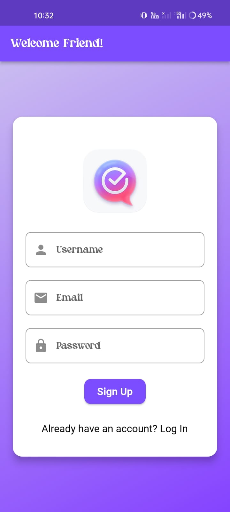
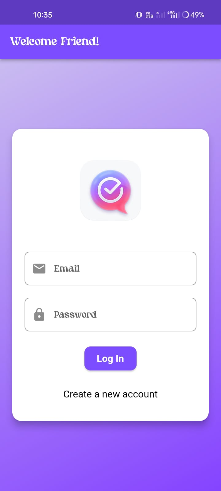
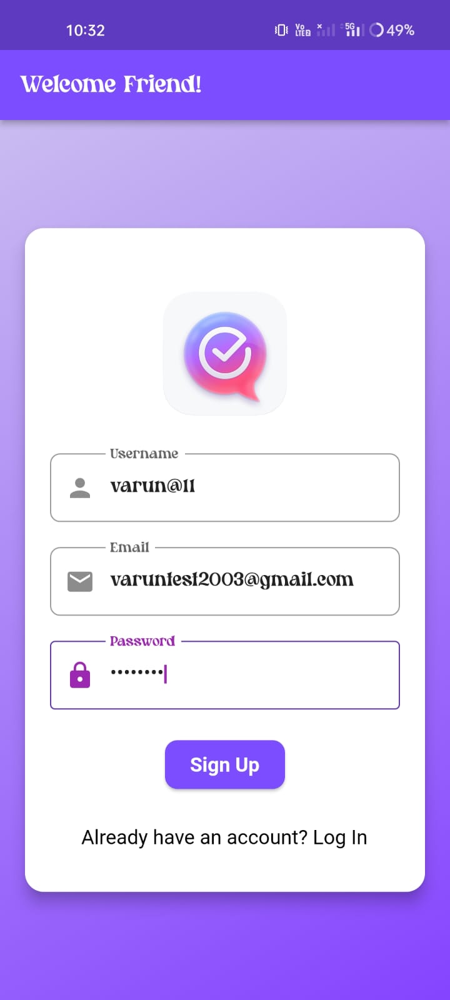
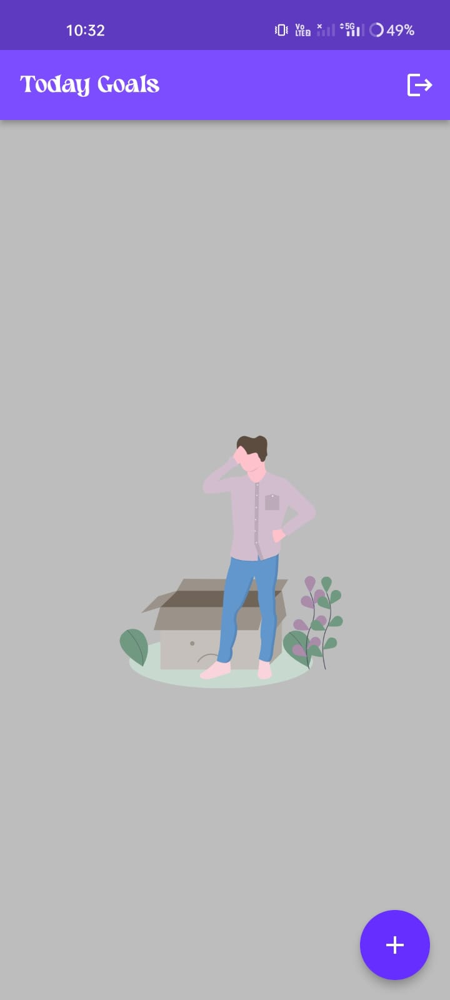
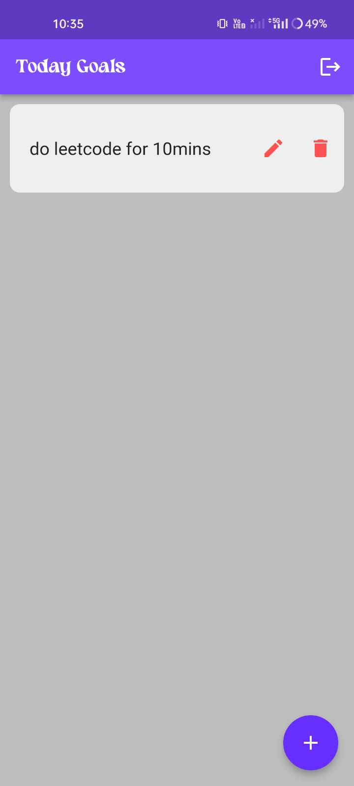
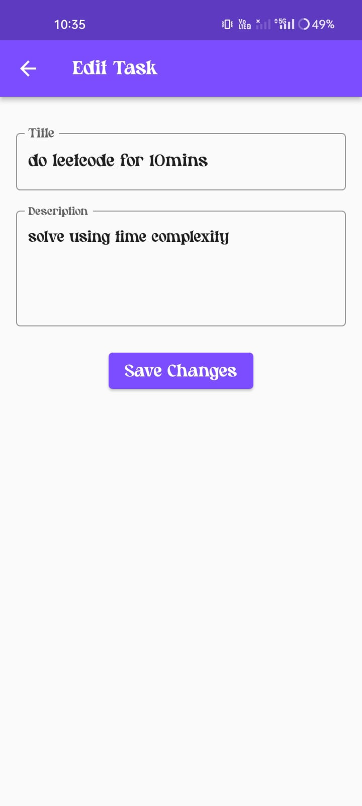

# **Documentation**

## **Overview**

**TaskMaster PRO** is a mobile application developed using **Flutter** and integrated with **Firebase** for backend services. The app leverages **Firebase Authentication** for secure user login and **Firebase Firestore** for storing and syncing tasks in real time. The primary goal is to provide users with a seamless and efficient platform to create, manage, and track tasks while ensuring synchronization across multiple devices.

---

## **Features**

1. **Secure User Authentication**
   - **Firebase Authentication** allows users to securely register and log in using email and password.
   - Users can recover their passwords via email if forgotten.

2. **Task Management**
   - Users can add, edit, and delete tasks. Each task can have a title, description, and due date.
   - Tasks are stored in **Firebase Firestore**, allowing them to be synced across devices in real time.

3. **Real-time Data Sync**
   - The app uses **Firebase Firestore** to ensure that task data is synced across all devices in real-time. Changes made on one device are reflected on others immediately.

---

## **Tech Stack**

1. **Flutter**  
   Flutter is used for building the user interface (UI), enabling the development of natively compiled applications for mobile, web, and desktop from a single codebase.

2. **Firebase Authentication**  
   Firebase Authentication handles user sign-up and login functionality using email and password.

3. **Firebase Firestore**  
   Firestore is used to store tasks and allows real-time synchronization, providing a scalable and flexible NoSQL cloud database.

4. **Flutter Packages**  
   - `firebase_auth`: For Firebase Authentication functionality.
   - `cloud_firestore`: For interacting with Firebase Firestore to store and retrieve task data.
   - `provider`: Used for state management across the app.
   - `shared_preferences`: For storing user preferences locally.

---

## **Installation & Setup**

### **Prerequisites**
- **Flutter SDK**: Download and install Flutter from the [official website](https://flutter.dev).
- **Firebase Project**: Set up a Firebase project and configure **Firebase Authentication** and **Firestore** by following the setup instructions from [Firebase's official guide](https://firebase.google.com/docs/flutter/setup).

### **Steps to Install**

1. **Clone the Repository**

   ```bash
   git clone https://github.com/Varun-Mayilvaganan/TaskMaster_Pro.git
   cd TaskMaster_Pro
   ```

2. **Install Dependencies**

   Run the following command to install all necessary packages:

   ```bash
   flutter pub get
   ```

3. **Configure Firebase**

   - Go to the [Firebase Console](https://console.firebase.google.com/) and create or use an existing Firebase project.
   - Enable **Email/Password Authentication** in Firebase Authentication.
   - Set up **Firestore** and create a database in **Test Mode**.
   - Download the configuration files:
     - For **Android**: `google-services.json`
     - For **iOS**: `GoogleService-Info.plist`
   - Place these files in the respective directories:
     - **Android**: `android/app/`
     - **iOS**: `ios/Runner/`

4. **Run the Application**

   After setting everything up, run the app on your device or emulator:

   ```bash
   flutter run
   ```

---

## **App User Flow**

1. **Login/Signup**  
   Users are prompted to log in or sign up using their email and password. Once authenticated, they are redirected to the **Home** screen. If not authenticated, they remain on the **AuthScreen**.







3. **Home Screen**  
   Upon successful login, users are directed to the **Home** screen, where they can view their tasks. From here, users can add, edit, or delete tasks.



5. **Task Management**  
   Users can create tasks by entering a title, description, and due date. These tasks are stored in Firestore and synced across devices in real-time.



7. **Logout**  
   Users can log out from the app using the logout button, which triggers Firebase Authentication's sign-out process.

---

## **Firebase Setup**

### **Firebase Authentication**

1. Go to the Firebase console and select **Authentication**.
2. Enable **Email/Password** sign-in method to allow users to register and log in.

### **Firebase Firestore**

1. Set up **Firestore Database** in **Test Mode** to allow read and write operations during development.

---

## **App Structure**

```
lib/
├── models/                     # Contains all data models
│   └── task.dart               # Task model class
├── screens/                    # UI Screens of the app
│   ├── auth_screen.dart        # Authentication screen (Login/Signup)
│   ├── home_screen.dart       # Home screen (task dashboard)
│   ├── add_task_screen.dart   # Add task screen
│   ├── edit_task_screen.dart  # Edit task screen
│   └── task_detail_screen.dart# Task detail screen
├── services/                   # Services for Firebase and app logic
│   ├── auth_service.dart       # Handles Firebase Authentication logic
│   └── firestore_service.dart  # Handles Firebase Firestore operations (CRUD for tasks)
├── widgets/                    # Reusable components
│   └── task_card.dart          # Widget that displays each task on the home screen
└── main.dart                   # Main entry point of the app, initializes Firebase and sets up routes
```

---

## **Troubleshooting**

- **App not loading tasks after login**: Ensure that your Firestore rules are set correctly and that the user is authenticated before attempting to read from Firestore.
- **Slow Firebase sync**: Verify that your internet connection is stable, and that Firestore is properly structured for efficient data access.

---

## **Future Improvements**

- **Task Sharing**: Allow users to share tasks with others for collaboration.
- **Task Progress Tracking**: Display task progress or history to users over time.

---

Thanks for viewing this documentation.
If you have any queries; please feel free to reach out to me!
varunmayilvaganan11@gmail.com
